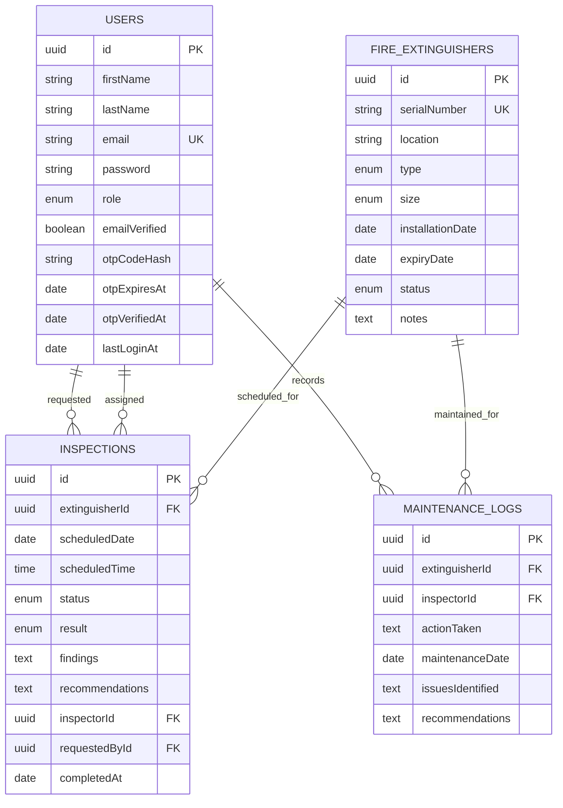

# TZW Fire Extinguisher Microservices Architecture

This repository now implements the TZW LTD Fire Extinguisher Management System as a microservices-oriented TypeScript monorepo.

The backend now runs as standalone Express services behind an API Gateway. The gateway preserves the frontend-facing `/api/...` paths, applies edge middleware, and forwards requests to service URLs. Each service has its own process, port, and PostgreSQL database name.

## Service Boundaries

| Service | Public route base | Internal route base | Default port | Default database |
| --- | --- | --- |
| API Gateway | `/api/*` | n/a | `5000` | none |
| Authentication Service | `/api/auth` | `/auth` | `5101` | `tzw_auth_db` |
| User Management Service | `/api/users` | `/users` | `5102` | `tzw_user_db` |
| Fire Extinguisher Management Service | `/api/extinguishers` | `/extinguishers` | `5103` | `tzw_extinguisher_db` |
| Inspection & Maintenance Service | `/api/inspections`, `/api/maintenance` | `/inspections`, `/maintenance` | `5104` | `tzw_inspection_maintenance_db` |
| Reporting Service | `/api/reports` | `/reports` | `5105` | `tzw_reporting_db` |
| Notification Service | `/api/notifications` | `/notifications` | `5106` | `tzw_notification_db` |

## Current Backend Layout

```text
backend/
  server.ts
  src/
    gateway/
      app.ts
      server.ts
    routes/
      authRoutes.ts                # Authentication Service route contract
      userRoutes.ts                # User Management Service route contract
    services/
      extinguishers/
        extinguisherModel.ts
        extinguisherController.ts
        extinguisherRoutes.ts
      inspections/
        inspectionModel.ts
        inspectionController.ts
        inspectionRoutes.ts
      maintenance/
        maintenanceModel.ts
        maintenanceController.ts
        maintenanceRoutes.ts
      notifications/
        app.ts
        server.ts
        emailService.ts
        notificationController.ts
        notificationRoutes.ts
        notificationService.ts
      reports/
        app.ts
        server.ts
        reportController.ts
        reportRoutes.ts
    models/
      User.ts
    middleware/
    config/
    utils/
```

## Public API Contract

Swagger UI is served at:

```text
http://localhost:5000/api-docs
```

The API gateway exposes these endpoint groups:

- `GET /health`
- `POST /api/auth/register`
- `POST /api/auth/verify-otp`
- `POST /api/auth/resend-otp`
- `POST /api/auth/login`
- `POST /api/auth/logout`
- `GET /api/auth/validate-token`
- `GET /api/auth/me`
- `PATCH /api/auth/change-password`
- `POST /api/auth/forgot-password`
- `POST /api/auth/reset-password`
- `GET/PATCH/DELETE /api/users`
- `GET/POST/PATCH/DELETE /api/extinguishers`
- `GET/POST/PATCH/DELETE /api/inspections`
- `GET/POST/PATCH/DELETE /api/maintenance`
- `GET /api/reports/dashboard`
- `GET /api/reports/inventory`
- `GET /api/reports/inspections`
- `GET /api/reports/compliance`
- `GET /api/reports/maintenance`
- `GET /api/reports/{reportType}/export?format=csv|pdf`
- `GET /api/notifications`

## RBAC Model

Roles are:

- `ADMIN`: manage users, inventory, inspections, maintenance logs, reports, exports, and operational alerts.
- `INSPECTOR`: manage extinguisher inventory, conduct inspections, log maintenance, view reports, and monitor notifications.
- `USER`: view extinguisher status, schedule inspections, and view their inspection/maintenance history.

## Database Design



Important constraints and indexes:

- `users.email` is unique.
- `fire_extinguishers.serialNumber` is unique.
- `fire_extinguishers.status`, `fire_extinguishers.type`, and `fire_extinguishers.expiryDate` are indexed for reporting.
- `inspections.extinguisherId`, `inspections.status`, `inspections.scheduledDate`, and `inspections.inspectorId` are indexed.
- `maintenance_logs.extinguisherId`, `maintenance_logs.inspectorId`, and `maintenance_logs.maintenanceDate` are indexed.

## Runtime Notes

The services are already separately bootable:

- `npm.cmd run start:gateway --workspace backend`
- `npm.cmd run start:auth --workspace backend`
- `npm.cmd run start:users --workspace backend`
- `npm.cmd run start:extinguishers --workspace backend`
- `npm.cmd run start:inspection-maintenance --workspace backend`
- `npm.cmd run start:reports --workspace backend`
- `npm.cmd run start:notifications --workspace backend`

Use `npm.cmd run dev:backend` from the repository root to build once and start all backend service processes concurrently.

Each service sets `SERVICE_DB_NAME` before loading Sequelize models. Keep service data isolated; do not import another service's model just to query another service's table.

## Service Communication

Development:

```text
Browser -> API Gateway -> standalone Express service -> service-owned PostgreSQL
```

Target deployment:

```text
Browser -> API Gateway
API Gateway -> Auth Service
API Gateway -> User Service
API Gateway -> Inventory Service
API Gateway -> Inspection Service
API Gateway -> Maintenance Service
API Gateway -> Reporting Service
API Gateway -> Notification Service
Services -> service-owned PostgreSQL schemas/databases
Services -> event broker for async notifications and read-model updates
```

Recommended events:

- `user.registered`
- `extinguisher.registered`
- `extinguisher.status_changed`
- `inspection.scheduled`
- `inspection.completed`
- `maintenance.logged`
- `report.export_requested`

This implementation publishes domain events to RabbitMQ through `publishDomainEvent`. The Notification Service consumes the `notification.email` queue and sends email alerts with Nodemailer.

## Email Notifications

Notification output is email-only. Configure:

```env
SMTP_HOST=smtp.gmail.com
SMTP_PORT=465
SMTP_USER=christiantc0000@gmail.com
SMTP_PASS=<gmail-app-password>
NOTIFICATION_DEFAULT_RECIPIENT=christiantc0000@gmail.com
RABBITMQ_URL=amqp://localhost
RABBITMQ_EXCHANGE=tzw.domain.events
NOTIFICATION_QUEUE=notification.email
```

Do not hardcode SMTP passwords in source files.

## Deployment Guide

1. Install dependencies:

   ```bash
   npm install
   ```

2. Configure backend env from `backend/.env.example`.

3. Ensure PostgreSQL is running and create each service database listed in `backend/.env.example`.

4. Build:

   ```bash
   npm.cmd run build
   ```

5. Start all backend services:

   ```bash
   npm.cmd run start:backend
   ```

6. Open:

   - Frontend: `http://localhost:3000`
   - API docs: `http://localhost:5000/api-docs`
   - Health: `http://localhost:5000/health`

## Database Export

Use `pg_dump` for handover backups:

```bash
pg_dump -h localhost -U postgres -d tzw_auth_db -F c -f backups/tzw_auth.dump
pg_dump -h localhost -U postgres -d tzw_user_db -F c -f backups/tzw_user.dump
pg_dump -h localhost -U postgres -d tzw_extinguisher_db -F c -f backups/tzw_extinguisher.dump
pg_dump -h localhost -U postgres -d tzw_inspection_maintenance_db -F c -f backups/tzw_inspection_maintenance.dump
```

Restore example:

```bash
createdb -h localhost -U postgres tzw_fire_safety_restore
pg_restore -h localhost -U postgres -d tzw_fire_safety_restore backups/tzw_fire_safety.dump
```

## User Manual

1. Register a user account.
2. Verify the signup OTP.
3. Sign in.
4. Admin assigns roles from **Users**.
5. Admin or Inspector registers extinguishers from **Fire Extinguishers**.
6. Users, Admins, or Inspectors schedule inspections from **Inspections**.
7. Inspectors complete inspections and record results.
8. Inspectors log maintenance from **Maintenance**.
9. Admins or Inspectors review dashboards and exports from **Reports**.
10. Admins or Inspectors monitor operational alerts from the Notification Service endpoint.

## UI Mockup Coverage

The implemented Mantine screens map to the required mockups:

- Registration Form: `frontend/src/pages/Register.tsx`
- Login Form: `frontend/src/pages/Login.tsx`
- Dashboard: `frontend/src/pages/Dashboard.tsx`
- Fire Extinguisher Management: `frontend/src/pages/Extinguishers.tsx`
- Inspection Scheduling: `frontend/src/pages/Inspections.tsx`
- Reports: `frontend/src/pages/Reports.tsx`
